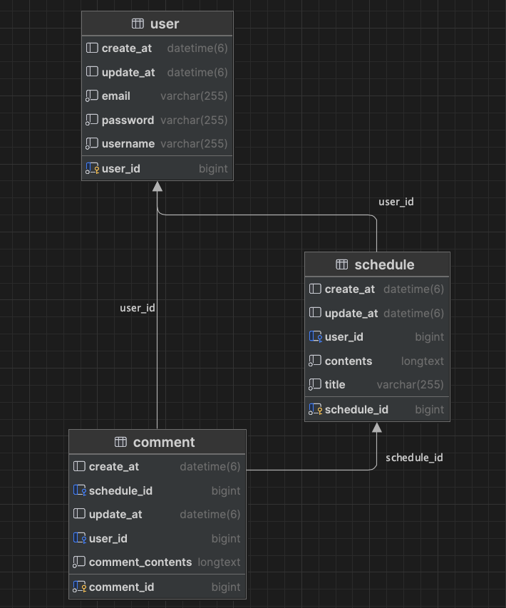

# API
## user
### 유저 등록
- method : POST
- url : /users/signup
- request body : 
  - username(string)
  - email(string)
  - password(string)
- request example :
  ```json
  {
    "username" : "이름1",
    "email" : "email1@example.com",
    "password" : "password1234"
  }   
    ```
- response : 201 CREATED
  - userId(long)
  - username(string)
  - email(string)
- response example :
  ```json
  {
    "userId": 1,
    "username": "이름1",
    "email": "email1@example.com"
  }
    ```
- validation response : 400 Bad Request
- validation response example :
  ```json
  {
    "field": "email",
    "message": "이메일 형식이 올바르지 않습니다."
  },
  {
    "field": "username",
    "message": "유저명은 4글자 이내"
  },
  {
    "field": "password",
    "message": "비밀번호는 최소 8자, 영문과 숫자를 포함해야 합니다."
  }
  ```
### 유저 로그인
- method : POST
- url : /users/login
- request body : 
  - userId(long)
  - email(string)
  - password(string)
- request example :
  ```json
  {
    "userId" : 1,
    "email" : "email1@example.com",
    "password" : "password1234"
  }
    ```
- response : 200 OK
- response example :
  ```json
  Login success
    ```
- response : 401 Unathorized
- response example :
  ```json
  Invalid email or password
    ```
### 유저 전체 조회
- method : GET
- url : /users
- request : X
- response : 200 OK
  - userId(long)
  - username(string)
  - email(string)
- response example :
  ```json
  [
    {
      "userId": 1,
      "username": "이름1",
      "email": "email1@example.com"
    },
    {
      "userId": 2,
      "username": "이름2",
      "email": "email1@example.com"
    }
    ...
  ]
    ```
### 유저 단일 조회
- method : GET
- url : /users/{user_id)
- request param : 
  - user_id (long)
- response : 200 OK
  - userId(long)
  - username(string)
  - email(string)
- response example :
  ```json
  {
    "userId": 1,
    "username": "이름1",
    "email": "email1@example.com"
  }
  ```
- no user response : 404 Not Found
- response example
  ```json
  {
    "timestamp": "2025-05-25T06:02:02.000+00:00",
    "status": 404,
    "error": "Not Found",
    "path": "/users/999"
  }
  ```
### 유저 수정
- method : PATCH
- url : /users/{user_id}
- request param :
  - user_id(long)
- request body :
  - username(string)
  - email(string)
- request example :
  ```json
  {
    "username": "name",
    "email" : "email11@example.com"
  }
  ```
- response : 200 OK
- no user response : 404 Not Found
- response example
  ```json
  {
    "timestamp": "2025-05-25T06:02:02.000+00:00",
    "status": 404,
    "error": "Not Found",
    "path": "/users/999"
  }
  ```
### 유저 삭제
- method : DELETE
- url : /users/{user_id}
- request  param : 
  - user_id (long)
- response : 200 OK

## schedule
### 일정 생성
- method : POST
- url : /schedules
- request body :
  - userId(long)
  - title(string)
  - contents(string)
- request example :
  ```json
  {
    "userId": 1,
    "title": "title1",
    "contents": "contents1"
  }
  ```
- response : 201 Created
  - scheduleId(long)
  - username(string)
  - title(string)
  - contents(string)
- response example : 
  ```json
  {
    "scheduleId": 1,
    "username": "name",
    "title": "title1",
    "contents": "contents1"
  }
  ```

### 일정 전체 조회
- method :
- url : /schedules
- request :
- request example :
- response :
- response example :

### 일정 단일 조회
- method :
- url : /schedules
- request :
- request example :
- response :
- response example :

### 일정 수정
- method :
- url : /schedules
- request :
- request example :
- response :
- response example :


### 일정 삭제
- method :
- url : /schedules
- request :
- request example :
- response :
- response example :


## comment
### 댓글 생성
- method :
- url : /comments
- request :
- request example :
- response :
- response example :

### 일정의 댓글 전체 조회
- method :
- url : /comments
- request :
- request example :
- response :
- response example :


### 일정의 댓글 단일 조회
- method :
- url : /comments
- request :
- request example :
- response :
- response example :


### 댓글 수정
- method :
- url : /comments
- request :
- request example :
- response :
- response example :

### 댓글 삭제
- method :
- url : /comments
- request :
- request example :
- response :
- response example :


# ERD

